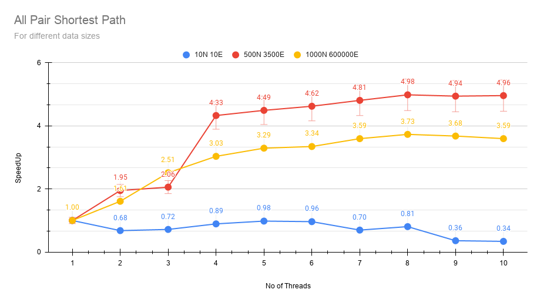

# Assignment 2

Parallel Computing (CS 309)

Adarsh Baghel 									11-04-2021

180001001

* * *

**Problem Statement:**

Write a multi-core program for the "all-pairs shortest paths" problem. The input is a weighted graph with no negative cycles and the expected output are lengths of the shortest paths between all pairs of vertices (where the length of a path is a sum of weights along the edges that the path consists of). Write a sequential program (no OpenMP directives at all) as well. Compare the running time of the sequential program with the running time of the multi-core program and compute the speedup

achieved.

1. for different number of cores and different number of threads per core, and

2. for different numbers of vertices and different numbers of edges.

### **Solution Approach:**

The all pair shortest path algorithm is also known as Floyd-Warshall algorithm is used to find all pair shortest path problems from a given weighted graph. As a result of this algorithm, it will generate a matrix, which will represent the minimum distance from any node to all other nodes in the graph.

The time complexity of this algorithm is **O(V^3)**, here V is the number of vertices in the graph

Steps in solving with Floyd-Warshall algorithm:

1. Initialize the solution matrix the same as the input graph matrix. Or we can say the initial values of shortest distances are based on shortest paths considering no intermediate vertex.

2. Loop 1 (fig1.1) : Add all vertices one by one to the set of intermediate vertices. Before the start of an iteration, we have shortest distances between all pairs of vertices such that the shortest distances consider only the vertices in set {0, 1, 2, .. k-1} as intermediate vertices. 

3. After the end of an iteration, vertex no. k is added to the set of intermediate vertices and the set becomes {0, 1, 2, .. k}

4. Loop 2 (fig1.1) : Pick all vertices as source one by one

5. Loop 3 (fig1.1) : Pick all vertices as destination for the above picked source

6. If vertex k is on the shortest path from i to j, then update the value of dist[i][j].

**fig:1.1 Serial Execution code for APSP**

The basic idea to parallelize the algorithm is to partition the matrix and split the computation between the processes. Each process is assigned to a specific part of the matrix.

**Parallel execution code for APSP**

##### **Motivation****:**

Using parallel programming concepts we can divide our bigger problem into a smaller problem, and the smaller individual problem can be assigned to a single core/processor/thread, here we use OpenMP (multi threading library) to achieve parallel execution. Here we are doing **Multi-Threading**.

**Solution given by OpenMP (Multi-Threading):**

* In Multithreading, a common address space is shared by all the threads. hence we need not to replicate data to each of the other threads, the **data remains shared** among all the threads. 

* In Multithreading, **Process creation** is economical, hence it does not use much resources.

* OpenMP provides solution to handle critical section, by using **#pragma omp critical(updateData)**

* * *

<table>
  <tr>
    <td>Testing for sample Input (Correctness):
10 10 
1 5 1
1 2 2
1 3 3
2 4 4
5 3 5
5 1 6
3 4 7
4 5 8
5 6 9
6 7 10</td>
    <td>How to run?
$ g++ -fopenmp apsp.cpp -o apsp
$ ./apsp < file10_10.in

Notes:
Create input file file.in which contains:
10 10    // no of nodes N, no of edges E
1 5 1    // E edge description: (from, to, weight)
1 2 2
1 3 3
2 4 4
5 3 5
5 1 6
3 4 7
4 5 8
5 6 9
6 7 10</td>
  </tr>
</table>

**Sample Output: **[ from -> to : cost ]

<table>
  <tr>
    <td>0 -> 0 : 0
1 -> 1 : 0
1 -> 2 : 18
1 -> 3 : 21
1 -> 4 : 14
1 -> 5 : 6
2 -> 1 : 2
2 -> 2 : 0
2 -> 3 : 23
2 -> 4 : 16
2 -> 5 : 8
3 -> 1 : 3
3 -> 2 : 17
3 -> 3 : 0
3 -> 4 : 13
3 -> 5 : 5
4 -> 1 : 6
4 -> 2 : 4
4 -> 3 : 7
4 -> 4 : 0
5 -> 2 : 12</td>
    <td>5 -> 3 : 15
5 -> 4 : 8
5 -> 5 : 0
6 -> 1 : 10
6 -> 2 : 21
6 -> 3 : 24
6 -> 4 : 17
6 -> 5 : 9
6 -> 6 : 0
7 -> 1 : 20
7 -> 2 : 31
7 -> 3 : 34
7 -> 4 : 27
7 -> 5 : 19
7 -> 6 : 10
7 -> 7 : 0
8 -> 8 : 0
9 -> 9 : 0
4 -> 5 : 12
5 -> 1 : 1</td>
  </tr>
</table>

* * *

### **Running for a variety of nodes and edges.**

### **Results:**

	

The execution time of the problem decreases with increasing the no. of threads, however after increasing the treads count by a certain number of threads, there is no significant improvement in execution time.

**Program run Time** v/s **No of threads** 

Fig2.1: Execution time for 10 Nodes and 10 Edges

Fig2.2: Execution time for 500 Nodes and 3500 Edges

Fig2.1: Execution time for 1000 Nodes and 600,000 Edges

**Observation:** 

1. For smaller size data, multiple threads usually results in increased execution time.

2. For larger size data, multiple threads gives good results, here execution time gets decreased.

3. There is a limit to which execution time can be improved, after a certain number the process management becomes more and hence it affects the execution times of the problem.

4. Somewhere between 4 - 8 threads performs best in this particular problem. 

* * *

#### **Speedup comparisons:**

<table>
  <tr>
    <td>No of Threads</td>
    <td>10N 10E</td>
    <td>500N 3500E</td>
    <td>1000N 600000E</td>
  </tr>
  <tr>
    <td>1</td>
    <td>1</td>
    <td>1</td>
    <td>1</td>
  </tr>
  <tr>
    <td>2</td>
    <td>0.6790034337</td>
    <td>1.948995374</td>
    <td>1.608394844</td>
  </tr>
  <tr>
    <td>3</td>
    <td>0.7164206756</td>
    <td>2.057402786</td>
    <td>2.512262621</td>
  </tr>
  <tr>
    <td>4</td>
    <td>0.8923061709</td>
    <td>4.326968984</td>
    <td>3.033072051</td>
  </tr>
  <tr>
    <td>5</td>
    <td>0.98089908</td>
    <td>4.490583049</td>
    <td>3.292327023</td>
  </tr>
  <tr>
    <td>6</td>
    <td>0.9629440782</td>
    <td>4.621346368</td>
    <td>3.344341969</td>
  </tr>
  <tr>
    <td>7</td>
    <td>0.6957280383</td>
    <td>4.806853809</td>
    <td>3.593945571</td>
  </tr>
  <tr>
    <td>8</td>
    <td>0.8054438817</td>
    <td>4.983026218</td>
    <td>3.729568828</td>
  </tr>
  <tr>
    <td>9</td>
    <td>0.3590852076</td>
    <td>4.941419878</td>
    <td>3.676297911</td>
  </tr>
  <tr>
    <td>10</td>
    <td>0.338136606</td>
    <td>4.957992157</td>
    <td>3.594464546</td>
  </tr>
</table>

fig3.1: Speedup table for multiple threads and there speedup on different datasets.

fig3.2: speedup vs no of threads for different data sizes

Comparing speedup vs no. of threads for different sizes of data. For large datasets parallel computing usually performs better. for smaller datasets, parallel processing does not give good results, which is significantly visible in fig3.2. 10N 10E dataset scores below the serial program.

* * *

**Code:**

<table>
  <tr>
    <td>/*
Adarsh Baghel
180001001

ASSIGNMENT-2 CS 359(2021)
__________________________________________

Problem Statement:

Write a multi-core program for the "all-pairs shortest paths" problem. 
The input is a weighted graph with no negative cycles and the expected 
output are lengths of the shortest paths between all pairs of vertices 
(where the length of a path is a sum of weights along the edges that 
the path consists of). Write a sequential program (no OpenMP directives 
at all) as well. Compare the running time of the sequential program 
with the running time of the multi-core program and compute the speedup
achieved.

1. for different number of cores and different number of threads per core, and
2. for different number of vertices and different number of edges.

How to run?
$ g++ -fopenmp apsp.cpp -o apsp
$ ./apsp < file10_10.in

*/

#include <bits/stdc++.h>
#include <time.h>
#include <omp.h>

using namespace std;

#define INF 99999

vector<vector<int>> floydWarshall (vector<vector<int>> graph)
{
	int V = graph.size();
	vector<vector<int>> dist(V,vector<int>(V));
	int i, j, k;

	dist = graph;

	for (k = 0; k < V; k++)
	{
		for (i = 0; i < V; i++)
		{
			for (j = 0; j < V; j++)
			{
				if (dist[i][k] + dist[k][j] < dist[i][j])
					dist[i][j] = dist[i][k] + dist[k][j];
			}
		}
	}

	return dist;
}

vector<vector<int>> floydWarshall_Parallel (vector<vector<int>> graph)
{
	int V = graph.size();
	vector<vector<int>> dist(V,vector<int>(V));
	int j, i, k, nthreads;

	dist = graph;

	for(nthreads=1; nthreads <= 10; nthreads++) {

	    omp_set_num_threads(nthreads);
	    
	    double start_time = omp_get_wtime();
	    
	    #pragma omp parallel shared(dist)
	    for (k = 0; k < V; k++)
	    {
		      vector<int> *dm = &dist[k];
		      #pragma omp parallel for private(i, j) schedule(dynamic)
		      for (i = 0; i < V; i++)
		      {
			        vector<int> *ds = &dist[i];
			        for (j = 0; j < V; j++)
			        {
			          	ds->at(j) = min(ds->at(j),ds->at(k)+dm->at(j));
			        }
		      }
		}
		    
	    double time = omp_get_wtime() - start_time;
	    printf("Total time for thread %d (in sec):%.8f\n", nthreads, time);
 	}
	return dist;
}

void printDiatance(vector<vector<int>> dist)
{
	int V = dist.size();
	for (int i = 0; i < V; i++)
	{
		for (int j = 0; j < V; j++)
		{
			if (dist[i][j] != INF)
				cout<<i<<" -> "<<j<<" : "<<dist[i][j]<<endl;
		}
	}
}

int main()
{

	int nV, nE;
	cin >> nV;
	cin >> nE;

	vector<vector<int>> graph(nV,vector<int>(nV));

	for (int i = 0; i < nV; ++i)
		for (int j = 0; j < nV; ++j)
			graph[i][j] = i==j?0:INF;

	
	/* 
	*	Takeing Graph Input
	*/
	int to,from, weight;
	for (int i = 0; i < nE; ++i)
	{
		cin >> from >> to >> weight;
		graph[to][from] = weight;
	}

	/* 
	*	Sequential All pair shortest path
	*/

	double start_time = omp_get_wtime();
	vector<vector<int>> ans = floydWarshall(graph);
	double time = omp_get_wtime() - start_time;
    printf("Total time for Sequential (in sec):%.8f\n", time);
	
	/* 
	*	Multiprocessing All pair shortest path
	*/
	vector<vector<int>> ans2 = floydWarshall_Parallel(graph);
	
	assert(ans==ans2);
	printDiatance(ans2);
	return 0;
}</td>
  </tr>
</table>

